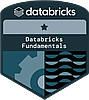
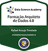
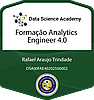

```python
@dataclass
class AboutMe:
  
    name: str = "Rafael Araujo Trindade"
    
    profession: str = "Data & Analytics Professional"
    
    preferred_tech_stack: List[str] = field(
        default_factory=lambda: [
            "Python", "PySpark", "SQL", "DBT", 
            "DuckDB", "ETL/ELT", "Apache Airflow",
            "Terraform", "Docker", "Kubernetes"
        ]
    )
    
    applied_in: List[str] = field(
        default_factory=lambda: [
            "Analytics Engineering",
            "Data Engineering",
            "Workflow Automation"
        ]
    )
```

<div align="justify">
  
  <b>Engenheiro de Dados & Analytics</b> com experiência na construção de arquiteturas eficientes, governáveis e escaláveis, com foco em performance, rastreabilidade e uso inteligente de recursos.
  Atuação no desenvolvimento de soluções resilientes por meio de <b>engenharia orientada a dados</b>, priorizando impacto e clareza técnica acima de ferramentas específicas.
  Foco na construção de pipelines e arquiteturas analíticas que garantem confiabilidade, rastreabilidade e suporte consistente à tomada de decisão.
  Aberto a projetos de alto impacto, com foco em engenharia bem feita, escala e geração de valor sustentável.

</div>

<div align="center">𝗗𝗔𝗧𝗔-𝗗𝗥𝗜𝗩𝗘𝗡 𝗘𝗡𝗚𝗜𝗡𝗘𝗘𝗥𝗜𝗡𝗚, 𝗡𝗢𝗧 𝗧𝗢𝗢𝗟-𝗗𝗥𝗜𝗩𝗘𝗡</div>

</br>

<div align="center">


</div>

<div align="center">

[](https://credentials.databricks.com/1ddd8ad3-0432-4d6b-a280-251f3b7e929a)&nbsp;
[](https://www.credly.com/badges/e009d579-a996-4083-858f-efa7224a7659/linked_in_profile)&nbsp;
[](https://www.credly.com/badges/a758b9c7-ce8f-4a03-bd88-6db21ed6f067/linked_in_profile)&nbsp;
[](https://drive.google.com/file/d/13XIyPdRbYIwV-2pG63NCZsumSTwamNKz/view)&nbsp;
[](https://drive.google.com/file/d/1QtBGcKScamFhxn0A4SCtYbjcLmU2CKkN/view)&nbsp;
[](https://drive.google.com/file/d/1ntb7OlUK8niom9TuPunf9xBcSg7fwCdh/view)

</div>

```python
@dataclass
class Project:
    name: str
    description: str
    technologies: List[str]

@dataclass
class Portfolio:
    projects: List[Project] = field(default_factory=list)

portfolio = Portfolio(
    projects=[
```

<div align="center">

[](https://github.com/rafa-trindade/kaggle-datahub)
[](https://github.com/rafa-trindade/oncoped-360)
[](https://github.com/rafa-trindade/petstore-pipeline)
[](https://github.com/rafa-trindade/pdp-analytics-engineering)
[](https://github.com/rafa-trindade/bi-rafatrindade)
[](https://github.com/rafa-trindade/b2b-grupotamburi)
[](https://github.com/rafa-trindade/petstore-scraping)
[](https://github.com/rafa-trindade/petstore-etl)
[](https://github.com/rafa-trindade/petstore-bi)
[](https://github.com/rafa-trindade/pdp-hospedagem)
[](https://github.com/anuraghazra/github-readme-stats)
<!--[](https://github.com/rafa-trindade/datafaker-rafatrindade)-->

</div>

```python
    ]
)
```

[](https://github.com/rafa-trindade)
